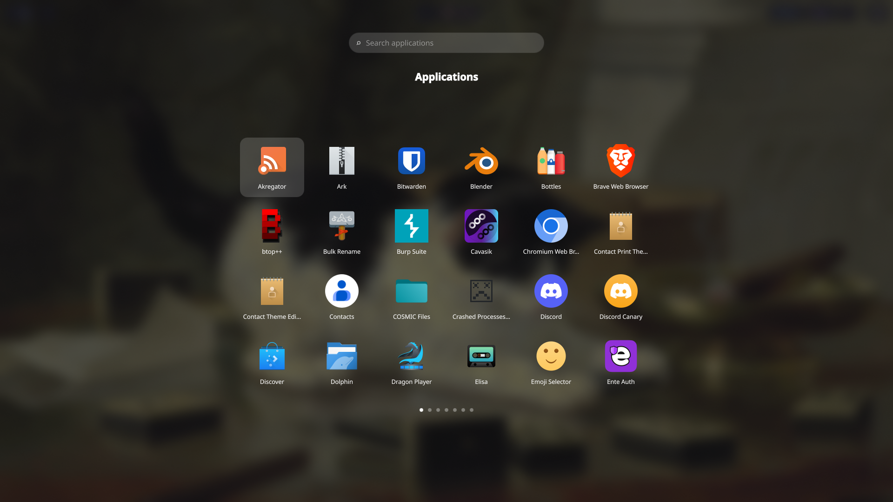
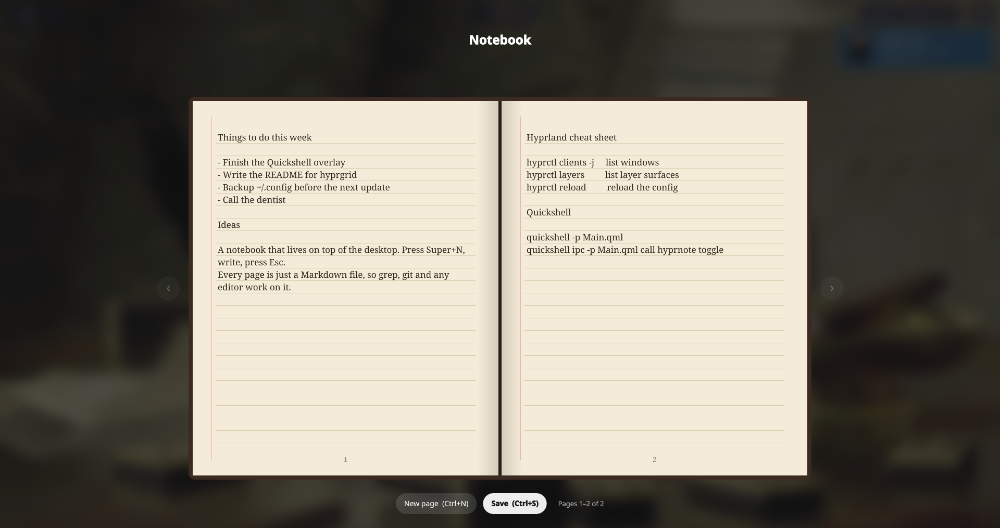
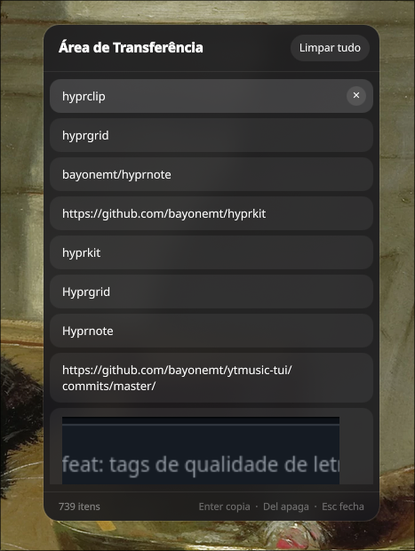
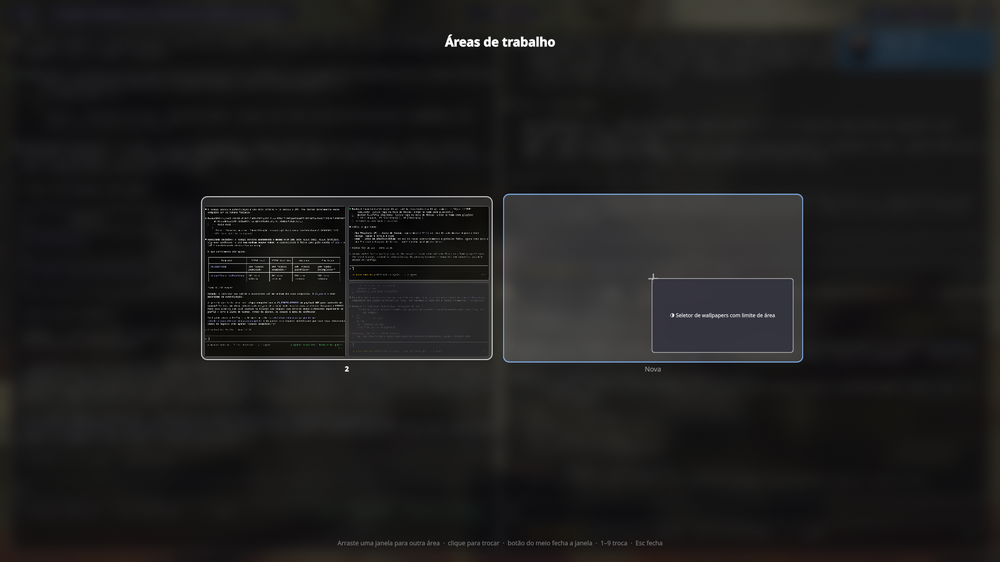
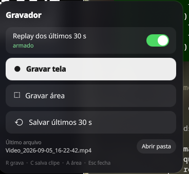

# hyprkit

A small kit of desktop overlays for [Hyprland](https://hyprland.org), built with [Quickshell](https://quickshell.org).

| | | |
| --- | --- | --- |
| [**hyprgrid**](hyprgrid/) | GNOME-style application grid | `Super+A` |
| [**hyprnote**](hyprnote/) | a notebook on top of your desktop, one Markdown file per page | `Super+N` |
| [**hyprclip**](hyprclip/) | floating clipboard history panel (cliphist) | `Super+V` |
| [**hyprws**](hyprws/) | workspace overview with drag-and-drop | `Super+Tab` |
| [**hyprrec**](hyprrec/) | screen recorder + instant replay of the last 30 s | `Super+R`, `Super+F10` |

Each one is a layer-shell overlay that runs as a daemon and is toggled through Quickshell IPC, so it opens instantly. Hyprland does the blur.

## hyprgrid



Search, paginated grid, keyboard navigation, icons from your theme. [Details →](hyprgrid/README.md)

## hyprnote



Two ruled pages, save with `Ctrl+S`, new page with `Ctrl+N`, every page a plain `.md` file in a folder you choose. [Details →](hyprnote/README.md)

## hyprclip



Opens at the cursor, text previews and image thumbnails, `Enter` copies, `Del` forgets. [Details →](hyprclip/README.md)

## hyprws



Every workspace as a live miniature, on every monitor. Drag windows between them, even across monitors; click to switch, middle-click to close. [Details →](hyprws/README.md)

## hyprrec



Record the screen or an area, and keep a 30-second replay buffer on the GPU that you save with one key. Built on gpu-screen-recorder. [Details →](hyprrec/README.md)

## Requirements

- Hyprland (tested on 0.56, works with both the Lua and the classic config; hyprws needs 0.55+)
- Quickshell 0.3 or newer, Qt 6 with QtQuick
- hyprclip also needs `cliphist` and `wl-clipboard`
- hyprrec needs `gpu-screen-recorder`, `slurp` and `libnotify`
- Optional for hyprgrid: the Qt GTK platform theme plugin, so icons come from your GTK icon theme

## Install

```sh
git clone https://github.com/bayonemt/hyprkit ~/.config/quickshell/hyprkit
```

Then add the three to Hyprland. With `hyprland.lua`:

```lua
hl.on("hyprland.start", function()
  hl.exec_cmd("~/.config/quickshell/hyprkit/hyprgrid/scripts/toggle.sh --daemon")
  hl.exec_cmd("~/.config/quickshell/hyprkit/hyprnote/scripts/toggle.sh --daemon")
  hl.exec_cmd("~/.config/quickshell/hyprkit/hyprclip/scripts/toggle.sh --daemon")
  hl.exec_cmd("~/.config/quickshell/hyprkit/hyprws/scripts/toggle.sh --daemon")
  hl.exec_cmd("~/.config/quickshell/hyprkit/hyprrec/scripts/toggle.sh --daemon")
  hl.exec_cmd("~/.config/quickshell/hyprkit/hyprrec/scripts/hyprrec.sh autostart")
end)

hl.bind("SUPER + A", hl.dsp.exec_cmd("~/.config/quickshell/hyprkit/hyprgrid/scripts/toggle.sh"))
hl.bind("SUPER + N", hl.dsp.exec_cmd("~/.config/quickshell/hyprkit/hyprnote/scripts/toggle.sh"))
hl.bind("SUPER + V", hl.dsp.exec_cmd("~/.config/quickshell/hyprkit/hyprclip/scripts/toggle.sh"))
hl.bind("SUPER + TAB", hl.dsp.exec_cmd("~/.config/quickshell/hyprkit/hyprws/scripts/toggle.sh"))
hl.bind("SUPER + R", hl.dsp.exec_cmd("~/.config/quickshell/hyprkit/hyprrec/scripts/toggle.sh"))
hl.bind("SUPER + SHIFT + R", hl.dsp.exec_cmd("~/.config/quickshell/hyprkit/hyprrec/scripts/hyprrec.sh record toggle"))
hl.bind("SUPER + F10", hl.dsp.exec_cmd("~/.config/quickshell/hyprkit/hyprrec/scripts/hyprrec.sh clip"))

for _, ns in ipairs({ "hyprgrid", "hyprnote", "hyprclip", "hyprws", "hyprrec" }) do
  hl.layer_rule({ name = ns, match = { namespace = "^(" .. ns .. ")$" }, blur = true, ignore_alpha = 0.2 })
end
```

With the classic `hyprland.conf`:

```ini
exec-once = ~/.config/quickshell/hyprkit/hyprgrid/scripts/toggle.sh --daemon
exec-once = ~/.config/quickshell/hyprkit/hyprnote/scripts/toggle.sh --daemon
exec-once = ~/.config/quickshell/hyprkit/hyprclip/scripts/toggle.sh --daemon
exec-once = ~/.config/quickshell/hyprkit/hyprws/scripts/toggle.sh --daemon
exec-once = ~/.config/quickshell/hyprkit/hyprrec/scripts/toggle.sh --daemon
exec-once = ~/.config/quickshell/hyprkit/hyprrec/scripts/hyprrec.sh autostart

bind = SUPER, A, exec, ~/.config/quickshell/hyprkit/hyprgrid/scripts/toggle.sh
bind = SUPER, N, exec, ~/.config/quickshell/hyprkit/hyprnote/scripts/toggle.sh
bind = SUPER, V, exec, ~/.config/quickshell/hyprkit/hyprclip/scripts/toggle.sh
bind = SUPER, TAB, exec, ~/.config/quickshell/hyprkit/hyprws/scripts/toggle.sh
bind = SUPER, R, exec, ~/.config/quickshell/hyprkit/hyprrec/scripts/toggle.sh
bind = SUPER SHIFT, R, exec, ~/.config/quickshell/hyprkit/hyprrec/scripts/hyprrec.sh record toggle
bind = SUPER, F10, exec, ~/.config/quickshell/hyprkit/hyprrec/scripts/hyprrec.sh clip

layerrule = blur, hyprgrid
layerrule = ignorealpha 0.2, hyprgrid
layerrule = blur, hyprnote
layerrule = ignorealpha 0.2, hyprnote
layerrule = blur, hyprclip
layerrule = ignorealpha 0.2, hyprclip
layerrule = blur, hyprws
layerrule = ignorealpha 0.2, hyprws
layerrule = blur, hyprrec
layerrule = ignorealpha 0.2, hyprrec
```

You can take only the ones you want; each folder is self-contained. Blur has to be enabled in `decoration:blur` for the backdrop effect to show.

## Common bits

- `scripts/toggle.sh` starts the daemon if needed and toggles the overlay. `--daemon` only starts it.
- Every overlay opens on the monitor Hyprland has focused (hyprws opens on all of them).
- The UI is in English, or Brazilian Portuguese when `LANG` starts with `pt`.
- After editing a QML file, restart that daemon: `pkill -f <name>/Main.qml` and run `toggle.sh --daemon` again.

## License

MIT
