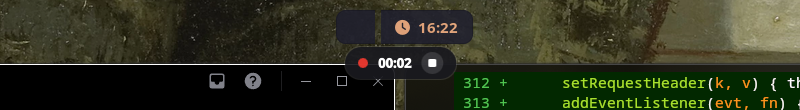

# hyprrec

Screen recorder and instant replay for [Hyprland](https://hyprland.org), built with [Quickshell](https://quickshell.org) on top of [gpu-screen-recorder](https://git.dec05eba.com/gpu-screen-recorder/about/).

Two things in one small panel:

- **Record** the screen or an area, with a red pill and a timer at the top while it runs.
- **Instant replay**: a buffer of the last 30 seconds is always being recorded on the GPU. Something cool happens, you press a key, the clip is saved. Like ShadowPlay.




## Features

- Replay buffer kept in RAM by the GPU encoder (NVENC / VA-API / QuickSync), so it costs almost nothing while idle
- Save the last N seconds with a hotkey; the buffer keeps rolling
- Record the whole monitor or a region picked with `slurp`, with system audio and microphone
- Recording indicator with elapsed time and a stop button
- Desktop notification with the file name whenever a clip or recording is saved
- Panel opens at the cursor: replay switch, record, record area, save clip, last file, open folder
- Everything is also a plain shell command, so you can bind whatever you want
- UI in English, or Brazilian Portuguese when `LANG` starts with `pt`

## Requirements

- Hyprland, Quickshell 0.3 or newer, Qt 6
- `gpu-screen-recorder` (the CLI; the GTK UI is not needed). On Fedora it is in the `brycensranch/gpu-screen-recorder-git` COPR, on Arch in the AUR, and there is a Flatpak
- `slurp` for area recording, `libnotify` (`notify-send`) for notifications, `xdg-user-dirs`
- A GPU with a hardware encoder. Software encoding is possible with gpu-screen-recorder but not what this is made for

## Install

```sh
git clone https://github.com/bayonemt/hyprkit ~/.config/quickshell/hyprkit
```

Then wire it into Hyprland. With the Lua config (`hyprland.lua`):

```lua
hl.on("hyprland.start", function()
  hl.exec_cmd("~/.config/quickshell/hyprkit/hyprrec/scripts/toggle.sh --daemon")   -- panel + indicator
  hl.exec_cmd("~/.config/quickshell/hyprkit/hyprrec/scripts/hyprrec.sh autostart")  -- start the replay buffer
end)

hl.bind("SUPER + R", hl.dsp.exec_cmd("~/.config/quickshell/hyprkit/hyprrec/scripts/toggle.sh"))                       -- panel
hl.bind("SUPER + SHIFT + R", hl.dsp.exec_cmd("~/.config/quickshell/hyprkit/hyprrec/scripts/hyprrec.sh record toggle")) -- start/stop recording
hl.bind("SUPER + F10", hl.dsp.exec_cmd("~/.config/quickshell/hyprkit/hyprrec/scripts/hyprrec.sh clip"))               -- save the last 30 s

hl.layer_rule({ name = "hyprrec", match = { namespace = "^(hyprrec)$" }, blur = true, ignore_alpha = 0.2 })
```

With the classic `hyprland.conf`:

```ini
exec-once = ~/.config/quickshell/hyprkit/hyprrec/scripts/toggle.sh --daemon
exec-once = ~/.config/quickshell/hyprkit/hyprrec/scripts/hyprrec.sh autostart
bind = SUPER, R, exec, ~/.config/quickshell/hyprkit/hyprrec/scripts/toggle.sh
bind = SUPER SHIFT, R, exec, ~/.config/quickshell/hyprkit/hyprrec/scripts/hyprrec.sh record toggle
bind = SUPER, F10, exec, ~/.config/quickshell/hyprkit/hyprrec/scripts/hyprrec.sh clip
layerrule = blur, hyprrec
layerrule = ignorealpha 0.2, hyprrec
```

## Configuration

Optional file `~/.config/hyprrec/config`, sourced by bash:

```sh
MONITOR="HDMI-A-1"                    # monitor for replay and "record screen"; empty = the focused one
FPS=60
REPLAY_SECONDS=30                     # size of the replay buffer
AUDIO="default_output|default_input"  # "|" merges sources into one track
QUALITY=very_high                     # medium | high | very_high | ultra
CODEC=""                              # empty = auto (h264); h264 | hevc | av1
REPLAY_AUTOSTART=yes                  # start the buffer on login (the `autostart` command honors this)
```

Videos go to `<your Videos folder>/hyprrec/Replays` and `.../Recordings`, named by gpu-screen-recorder with the date and time.

## Usage

| Where | Action |
| --- | --- |
| `Super+F10` | save the last 30 seconds |
| `Super+Shift+R` | start / stop recording the screen |
| `Super+R` | open the panel |
| panel: switch | turn the replay buffer on or off |
| panel: `R` / `C` / `A` / `Space` | record, save clip, record area, toggle replay |
| pill at the top: ■ | stop the recording |

## The command line

```sh
hyprrec.sh replay start|stop|toggle
hyprrec.sh clip [10|30|60|300]      # default: the whole buffer
hyprrec.sh record toggle|start|stop
hyprrec.sh record region            # pick an area with slurp
hyprrec.sh status                   # JSON, what the panel reads
hyprrec.sh open                     # open the videos folder
```

## How it works

One `gpu-screen-recorder` process runs in replay mode. `SIGUSR1` makes it write the buffer to a file; `SIGRTMIN` starts and stops a regular recording inside the same process, so recording never interrupts the replay. When the replay is off, `record` starts a standalone recorder instead. After every save gpu-screen-recorder runs `scripts/on-save.sh`, which sends the notification and tells the panel to refresh. State lives in `$XDG_RUNTIME_DIR/hyprrec`.

## License

MIT, see [LICENSE](../LICENSE). Part of [hyprkit](../README.md).
